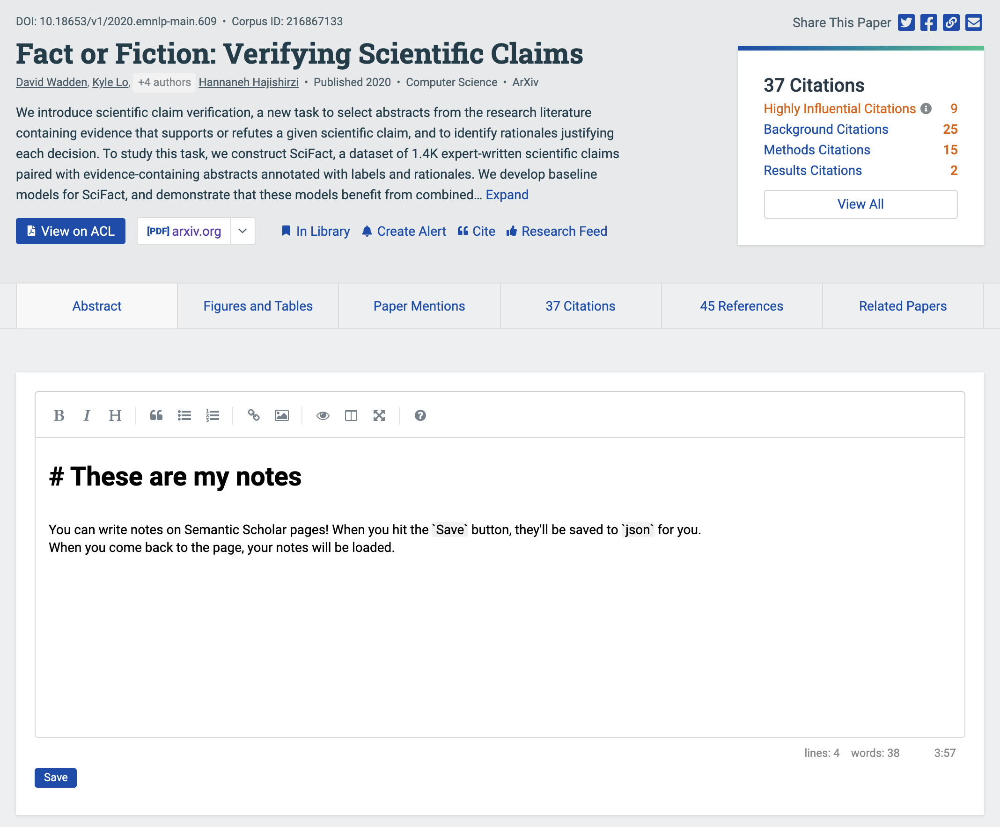

# Semantic Scholar notes

Do you use Semantic Scholar? Do you take notes when you read papers? This repo enables you to write and view your paper notes without leaving Semantic Scholar, like so:

It adds a notes section below the main information section on each paper. It supports Markdown as well as Mathjax. The notes are stored locally on your machine as `.json` files, in a directory of your choosing.

## Setup

This should work on Google Chrome, running on Mac:

- Clone the repo.
- Set the environment variable `S2_NOTES_DIR`, and create a directory at this location. It's probably easiest to put this in a startup file like your `.bash_profile` or `.bashrc`. This is where your notes will go.
- Install [Tampermonkey](https://www.tampermonkey.net) for Chrome.
- Create a new blank Tampermonkey script. Copy the contents of [frontend/s2-notes.js](frontend/s2-notes.js) from this repo into the Tampermonkey script, and save the script.
  - See the Tampermonkey docs for information on how to create and activate a script.
- In a terminal window, navigate to the `backend` subdirectory of this repo and enter `bash run.sh`. The server should start.

## Usage

Once you've got the Tampermonkey script installed and the backend server running, you should see a notes window like the one in the image above, for every article page on Semantic Scholar. Two caveats:

- When you navigate to a new paper, you may need to refresh the page in order for the notes section to show up. I'll try to fix this, or I'd welcome a PR to do it!
- Make sure to *save your notes*, they will not save automatically.

## Storage details

When you click `Save`, your notes are dumped to a `.json` file in the directory given by the `S2_NOTES_DIR` environment variable. The files are named by their *Semantic Scholar ID*, which is a unique `int` associated with each paper. The following fields are recorded in the `json`.

- `author: str`: First paper author, according to Semantic Scholar (S2).
- `doi: (str | null)`: DOI. If available, you can use it to look up the paper at [doi.org](https://www.doi.org/).
- `doi_link: (str | null)`: A DUI URL. If available, it should give a direct link to the paper.
- `notes: str`: Your notes for this paper.
- `paper_id: int`: The S2 paper ID; same as the filename.
- `timestamp: int`: Output of Javascript `Date.now()`. Just gives a timestamp for when you saved this note.
- `title: int`: Paper title.

## Troubleshooting

I can only offer "support" for Chrome on Mac.

- If you see a text box for your notes, but it's way too small and doesn't have any Markdown formatting, it's probably because the required libraries didn't load in time. Just refresh the page and it should work.

Otherwise, feel free to open an issue with logs from both:

- The JavaScript console.
- The Flask backend server.

## Feature additions / fixes (help welcome)

I am very much a web programming amateur, so I did my best to hack something together, but I would definitely accept PR's. In particular:

- A PR so that you don't have to reload the page in order for the notes to show up. Right now, I'm using the page load event to trigger the notes field, [here](frontend/s2-notes.js#L186), but this doesn't always work. Is there some other event I should be triggering on?
- A PR to auto-save the notes in some sensible fashion.

## Acknowledgments

Thanks to [Jiechen Chen](https://www.linkedin.com/in/jiechen-chen/) for writing the backend!
